###### Dear English speaking users, unfortunately this project is only in Russian at the moment. Sorry for the inconvenience.

# DolboNet
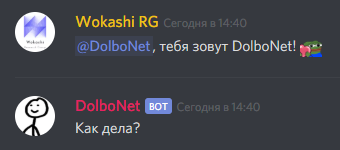

Мы рады представить Вам нашу разработку - **Русскоязычный чат-бот для [Discord] на архитектуре [Transformer]**. 

Нейронная сеть обучена на **36M+** публично доступных сообщениях [наиболее популярных русскоязычных серверов **Discord**][PopularServers] в течение одной эпохи *(5 суток на **GTX 1080**)*. Обучение проходило по принципу: ***какое сообщение вероятнее всего будет отправлено после 10-ти предыдущих*** на уровне [**character trigram embeddings**][N-grams]. 

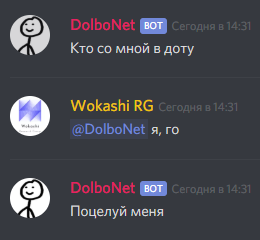

Данный бот **не использует** готовую базу данных сообщений, а генерирует новые уникальные сообщения, реализуя концепцию **seq2seq на архитектуре [Transformer]**. Основа сети взята из [этого][Tutorial] руководства по **[TensorFlow 2]**.

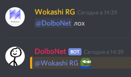

**Поехали!** 🚀

# Установка

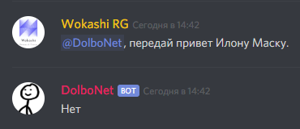

## Windows 10 64-bit
Протестировано на **2 x 2.6 ГГц CPU + 4 ГБ RAM**.
- Установите [**Python 3.8 64-bit**][Python]
- При установке [**Python 3.8 64-bit**][Python] должны стоять галочки `Install launcher for all users (recommended)` и `Add Python 3.9 to PATH`
- Установите **[Git]**
- Установите [**Visual C++ Redistributable**][Vcredist] - необходим для `scipy`
- Откройте **Git Bash**, щелкнув правой кнопкой мыши по пустому месту внутри папки *(например, **Мои документы**)* и выбрав `Git Bash Here`
- Скачайте репозиторий: `git clone https://github.com/sergree/DolboNet`
- Перейдите в папку: `cd DolboNet`
- Выполните `pip install -r requirements.txt` в появившемся окне
- [Получите][DiscordDevelopers] токен вашего бота - [инструкция][HowToGetToken]
- Отредактируйте файл конфигурации `config.py`, вставив токен бота в `token = "..."`
- И наконец, запустите бота: `python bot.py`
- *Бот будет загружаться 5-10 минут*

Бот заработает **только** на **64-разрядной** версии **Windows** и **Python**.

## Ubuntu 20.04 LTS
Протестировано на **2 x 2.6 ГГц CPU + 2 ГБ RAM**.
- Скачайте репозиторий: `git clone https://github.com/sergree/DolboNet`
- Перейдите в папку: `cd DolboNet`
- Если ещё не установлен `pip3`, то установите его: `sudo apt install python3-pip`
- Установите зависимости: `pip3 install -r requirements.txt`
- [Получите][DiscordDevelopers] токен вашего бота - [инструкция][HowToGetToken]
- Отредактируйте файл конфигурации: `nano config.py`, вставив токен бота в `token = "..."`
- И наконец, запустите бота: `python3 bot.py`
- *Бот будет загружаться 5-10 минут*

## Поддержка GPU
Если на машине присутствует видеокарта **NVIDIA**, то Вы можете запустить бота используя **CUDA**, что даст прирост в скорости работы.
- Удалите `tensorflow`, если успели установить зависимости: `pip uninstall tensorflow`
- Установите **CUDA® Toolkit** и **cuDNN SDK** - [инструкция][HowToGPU]
- Установите `pip install tensorflow-gpu>=2.3.1` или `pip install -r requirements_gpu.txt`

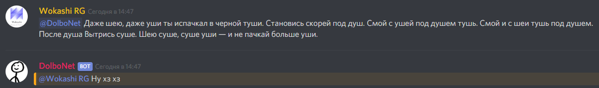

⚠️ Не советуем настраивать **поддержку GPU**, если Вы делаете это впервые и у Вас нет желания потратить на процесс установки весь вечер ⚠️

# Дополнительные настройки
В файле `config.py` можно отредактировать некоторые параметры, чтобы изменить характер и поведение бота:
- `temperature` - [температура семплирования][Temperature] - регулирует характер и разнообразие генерируемого текста

| Значение | Описание                       |
|----------|--------------------------------|
| 0.01     | Я знаю только слово **Привет** |
| 0.3      | Попугай-повторюшка             |
| 0.65     | По-умолчанию                   |
| 1.3      | Пьяный поэт                    |
| 3        | Уснул на клавиатуре            |

Для удобства экспериментирования присутствует команда `!temp значение`, которую можно отправлять в **[Discord]**, чтобы редактировать это значение *на ходу*. Команда работает только у пользователей с привилегией **Администратор**.

- `mention_prob` - вероятность того, что бот ответит на сообщение, в котором его упомянули. Может принимать значения от `0` до `1`. По умолчанию: `1`, т.е. **100%**
- `no_mention_prob` - вероятность того, что бот ответит на сообщение, в котором его не упоминали. Может принимать значения от `0` до `1`. По умолчанию: `0.2`, т.е. **20%**
- `command_temperature_change` - команда изменения температуры, если не нравится `!temp значение` 😛
- `use_delay` - эмуляция человеческой скорости печати на клавиатуре, по-умолчанию `False`, т.к. на **CPU** процесс генерации и так не быстрый
- `discord_game_name` - статус бота в **[Discord]**

Остальные параметры лучше не редактировать.

# Кофе
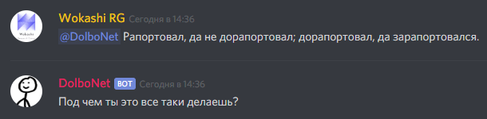

☕ Если Вы заинтересованы в развитии проекта, Вы можете [купить мне кофе][BMC]. ☕

**Спасибо!** 🙏

# FAQ

> _У меня половина сервера таких долбонетов, зачем нужен ещё один?_

- Он может помогать в модерации:

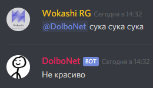

- Иногда даже очень хорошо:

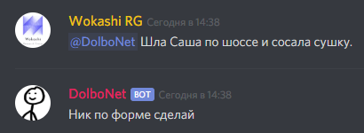

- Любит аниме:

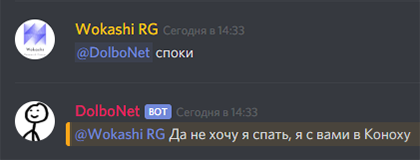

- Делится свежими новостями:

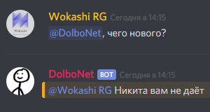

- А ещё он не даст заскучать:

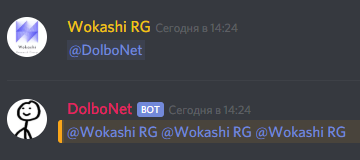

- Ну и, конечно же, у него отличный вкус:

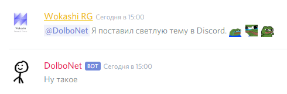

А если серьёзно, причина только [одна][Tweet].

> _Хостите ли вы этого бота? Могу ли я обойтись публичной версией? Дайте ссылку!_

<!--- Мы не хостим публичную версию бота, потому что процесс генерации сообщения [трансформером][Transformer] не дешевый с точки зрения ресурсов. При скорости генерации **~0.1 секунды на токен**, если бы этот бот находился на 50-ти публичных **Discord** серверах, то он бы работал *очень медленно*. --->
~~[Ссылка][BotInvite]. Бот доступен не всегда и иногда отвечает медленно.~~
Мы не хостим публичную версию бота. Чтобы он появился на Вашем **[Discord]** сервере, его необходимо [установить][Setup].

> _На каких серверах этот бот уже есть?_

Мы знаем, что бот уже хостится здесь:
- **[! REPUBLIC OF PEPESTAN & ITS CITIZENS][Server1]**
- **[FUNCLUB][Server4]**
- **[LeviaFun][Server3]**
- **[! Molecular Dream World ☘][Server2]**

[Напишите нам], чтобы попасть в этот список.

> _Что-то он в основном бессвязный бред отправляет._ 🤔

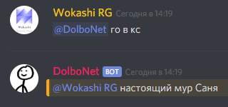

Да, есть такое. Но иногда получается забавно.

> _Это же бесполезная фигня, вы понимаете?_

Конечно. Как и [многое другое в нашем современном мире][Trends].

> _Бот отправил мне оскорбление или угрозу! Беспредел!_ 😠

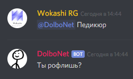

Нейронная сеть бота лишь отражает публичные данные, на которых проходило обучение. Возможно, это тревожный звоночек о том, [что стало с нашим обществом][Rebyata]. В любом случае, мы не хотели.

> _Что насчёт английского языка?_

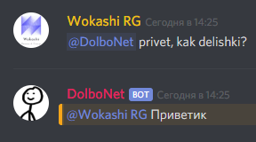

На данном этапе мы решили не расходовать ёмкость сети на латинские триграммы. Латиница автоматически транслитерируется в кириллицу с помощью **[opendatakosovo/cyrillic-transliteration]**. *Мы тестировали много подобных библиотек, [эта][opendatakosovo/cyrillic-transliteration] - самая быстрая.*

> _Почему триграммы?_

Потому-что [великий и могучий]. Идея, конечно же, не наша, а взята из [этой книги][Book].

> _Может было бы лучше использовать [стемминг]?_

В данном кейсе нет. Так как лдюи в чатах пиушт с очепятками, а инагда с ашебками. A inogda translitom, ile fse vmesti. 🤪

*Другое дело википедию или новостные ленты разбирать.*

> _Он и эмодзи умеет отправлять?_

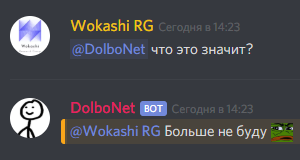

Да. Только пока рандомно. *Всем кастомным эмодзи присвоен единый токен в словаре.* В будущем есть планы привязать **[CNN]** с классификатором.

> _Вы просто скопировали гайд для **[TensorFlow 2]**, что вы сделали сами?_

- Алгоритм токенизации русского текста и разбора сущностей **[Discord]**: упоминания пользователей / ролей / каналов, ссылки, эмодзи и т.д.
- Перелопатили уйму доступных реализаций **[Transformer]**
- Нашли [подходящую реализацию][Tutorial] и связали её с нашим токенизатором и **[Discord API]**
- Спарсили **36M+** публичных сообщений русскоязычного **[Discord]** комьюнити и обучили [трансформер][Transformer] на нём
- Напечатали *этот текст*

> _А как же **[LSTM]**?_

Мы просто оставим [это здесь][TransformerExplained].

> _Что дальше?_

- Больше парсить, дольше обучать
- **[CNN]** для классификации эмодзи без учителя
- Пробуем **[Universal Transformer]**
- И **[Transformer XL]**
- Если не закончится [кофе][BMC]

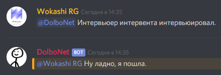

🤖

[Discord]: https://discordapp.com/
[DiscordDevelopers]: https://discordapp.com/developers/applications/
[Tutorial]: https://github.com/tensorflow/examples/blob/master/community/en/transformer_chatbot.ipynb
[TensorFlow 2]: https://www.tensorflow.org
[HowToGetToken]: https://www.writebots.com/discord-bot-token/
[HowToGPU]: https://www.tensorflow.org/install/gpu#software_requirements
[Transformer]: https://arxiv.org/abs/1706.03762
[PopularServers]: https://discord-server.com/?language=ru&page=1&rowsOnPage=50&sort=count_desc
[N-grams]: https://ru.wikipedia.org/wiki/N-%D0%B3%D1%80%D0%B0%D0%BC%D0%BC%D0%B0
[Python]: https://www.python.org/ftp/python/3.8.6/python-3.8.6-amd64.exe
[Git]: https://gitforwindows.org/
[Vcredist]: https://www.microsoft.com/en-us/download/details.aspx?id=48145
[BMC]: https://www.buymeacoffee.com/sergree
[opendatakosovo/cyrillic-transliteration]: https://github.com/opendatakosovo/cyrillic-transliteration
[Великий и могучий]: https://ru.wikipedia.org/wiki/%D0%A0%D1%83%D1%81%D1%81%D0%BA%D0%B8%D0%B9_%D1%8F%D0%B7%D1%8B%D0%BA
[стемминг]: https://ru.wikipedia.org/wiki/%D0%A1%D1%82%D0%B5%D0%BC%D0%BC%D0%B8%D0%BD%D0%B3
[Book]: https://www.piter.com/product/glubokoe-obuchenie
[Rebyata]: http://lurkmore.to/%D0%91%D1%8B%D0%B4%D0%BB%D0%BE
[CNN]: https://ru.wikipedia.org/wiki/%D0%A1%D0%B2%D1%91%D1%80%D1%82%D0%BE%D1%87%D0%BD%D0%B0%D1%8F_%D0%BD%D0%B5%D0%B9%D1%80%D0%BE%D0%BD%D0%BD%D0%B0%D1%8F_%D1%81%D0%B5%D1%82%D1%8C
[Discord API]: https://github.com/Rapptz/discord.py
[Tweet]: https://twitter.com/elonmusk/status/1095574487104315392
[Temperature]: https://cs.stackexchange.com/questions/79241/what-is-temperature-in-lstm-and-neural-networks-generally
[Trends]: http://lurkmore.to/%D0%9C%D0%BE%D0%B4%D0%B0
[LSTM]: https://ru.wikipedia.org/wiki/%D0%94%D0%BE%D0%BB%D0%B3%D0%B0%D1%8F_%D0%BA%D1%80%D0%B0%D1%82%D0%BA%D0%BE%D1%81%D1%80%D0%BE%D1%87%D0%BD%D0%B0%D1%8F_%D0%BF%D0%B0%D0%BC%D1%8F%D1%82%D1%8C
[TransformerExplained]: https://habr.com/ru/post/341240/
[Universal Transformer]: https://arxiv.org/abs/1807.03819
[Transformer XL]: https://arxiv.org/abs/1901.02860
[Git LFS]: https://git-lfs.github.com/
[Server1]: https://discordapp.com/invite/TVw8NKv
[Server2]: https://discordapp.com/invite/HmK6xsS
[Server3]: https://discordapp.com/invite/XUJq5WR
[Server4]: https://discordapp.com/invite/mUsxsST
[BotInvite]: https://discordapp.com/api/oauth2/authorize?client_id=584636018125176834&permissions=3072&scope=bot
[Setup]: https://github.com/sergree/DolboNet#%D1%83%D1%81%D1%82%D0%B0%D0%BD%D0%BE%D0%B2%D0%BA%D0%B0
[Напишите нам]: mailto:wokashi.rg@gmail.com
